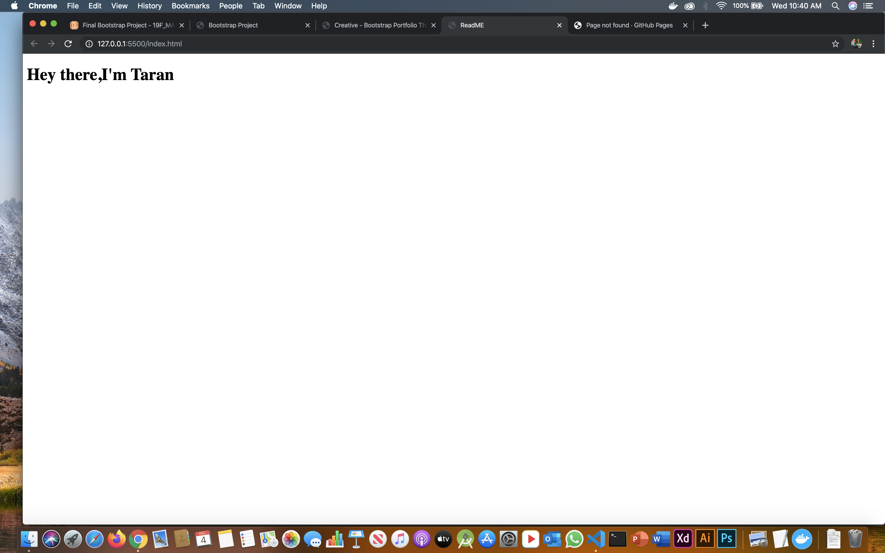

# HTML and CSS 101

#### By:Amzaing prof

* Basic of HTML
* How to connect css file
* How to read documentation


``` javascript

let a=20;
let b=20;

console.log("The final addition is:"a+b);

```
CSS 
```css
h1{
    background-color:red;
}
```
* [x] Wrote the first h1 tag
* [x] connected my css file to the HTML file
* [] Change the background color


Made with :heart: in MAD9013

